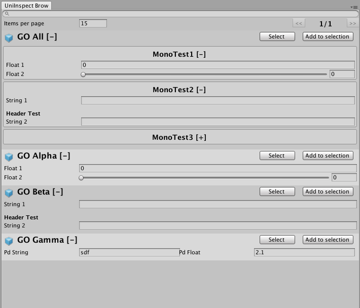

# UniInspect
It's an editor utility helps Unity developer to do data centralisation.

## Features
- Data centralisation
- Result paging
- Target object selection
- Foldable results
- Editor only / non-invasive
- Filter results by object name / component name / member name

## Prerequisites
Tested on Unity Versions:
- :white_check_mark: 2017.x.x
- :white_check_mark: 2018.1.x
- :white_check_mark: 2018.2.x
- :x: 2018.3.x (not supported yet)
- :question: Older than 2017.4.x

## Installing
1. Clone the repo and drop that folder right into your project.
2. Download the zip file directly and extract the contents to your project.
3. Add the repo as a submodule to your git.

## Usage
1. Mark your serializable member `[UniInspect]`

2. Check out your result on `UniInspect/Browser` window

## Others
1. Decoration property attributes will also affect the display result.
2. You can make your own property drawer to modify its outlook (in theory).
3. This project is still working in progress.
